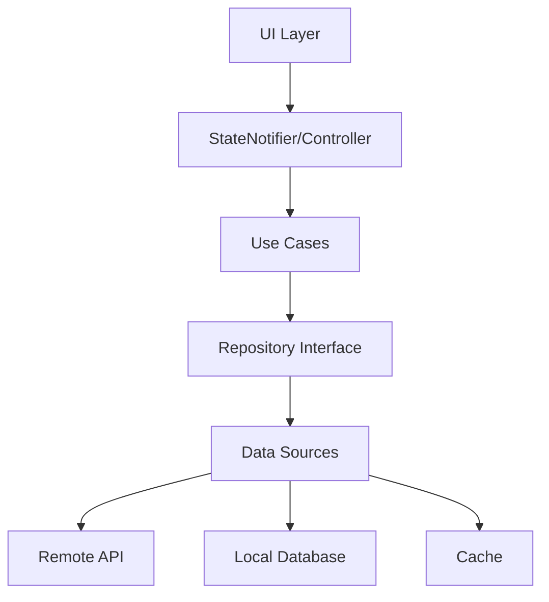

# 1. نظرة عامة على المعمارية النظيفة

## 1. Clean Architecture Overview

> **الجزء الأول: المعمارية والأنماط الأساسية | Part I: Architecture & Core Patterns**

---

## 🎯 **Objective | الهدف**
Implement Clean Architecture for robust, maintainable Flutter e-commerce application with clear separation of concerns and testable code structure.

## 📋 **Rule | القاعدة**
**Arabic**: افصل بين الطبقات: Presentation (UI), Application (State/Use-cases), Domain (Entities), Data (Repos & Sources)  
**English**: Separate layers: Presentation (UI), Application (State/Use-cases), Domain (Entities), Data (Repos & Sources)

## 💡 **Benefits | الفوائد**
- **Easy Testing | اختبار سهل**: Each layer can be tested independently without dependencies
- **Reduced Coupling | تقليل الترابط**: Changes in one layer don't affect others
- **Source Flexibility | مرونة المصادر**: Easy to switch data sources or UI frameworks
- **Maintainability | سهولة الصيانة**: Clear separation of concerns makes code easier to maintain
- **Team Collaboration | تعاون الفريق**: Different team members can work on different layers
- **Scalability | قابلية التوسع**: Easy to add new features without affecting existing code

## 🛠️ **Implementation | التطبيق**
- **Use in**: All features and modules across the application
- **How to implement**:
  - Create feature-first folder structure
  - Implement Repository pattern for data access
  - Use Dependency Injection for layer communication
  - Keep business logic in Domain layer only
  - Use interfaces/abstract classes for layer boundaries
- **Result**: Maintainable, testable, and scalable codebase

## ✅ **Success Criteria | معايير النجاح**

> **Reference**: See [Success Criteria Template](../../00-Templates/06_Success_Criteria_Template.md) for standard criteria.

### **Architecture Specific Criteria:**
- [ ] All features follow clean architecture principles
- [ ] No direct API calls from UI layer
- [ ] Business logic isolated in Domain layer
- [ ] Easy to mock dependencies for testing
- [ ] Clear layer boundaries with no circular dependencies
- [ ] Each layer has single responsibility

## ⚠️ **Common Pitfalls | الأخطاء الشائعة**

> **Reference**: See [Common Pitfalls Template](../../00-Templates/05_Common_Pitfalls_Template.md) for standard pitfalls.

### **Architecture Specific Pitfalls:**
- **Avoid**: Business logic in Widgets or UI components
- **Avoid**: Direct API calls from Presentation layer
- **Avoid**: Circular dependencies between layers
- **Avoid**: God classes that handle multiple responsibilities
- **Avoid**: Tight coupling between layers
- **Avoid**: Data layer knowing about UI requirements

## 🚨 **Risk Assessment | تقييم المخاطر**

> **Reference**: See [Risk Assessment Template](../00-Templates/01_Risk_Assessment_Template.md) for standard risk categories.

### **Architecture-Specific Risks:**
| Risk | Impact | Probability | Mitigation Strategy |
|------|--------|-------------|-------------------|
| **Layer Violations** | High | Medium | Architecture tests, dependency rules, code reviews |
| **Circular Dependencies** | High | Medium | Dependency inversion, interface segregation |
| **God Classes** | Medium | High | Single responsibility principle, class decomposition |
| **Tight Coupling** | Medium | High | Dependency injection, abstraction layers |
| **Poor Testability** | High | Medium | Mock-friendly design, clear boundaries |
| **Performance Bottlenecks** | Medium | Low | Layer optimization, proper state management |

## 📊 **Implementation Priority | أولوية التنفيذ**

> **Reference**: See [Implementation Priority Template](../00-Templates/02_Implementation_Priority_Template.md) for standard phases.

### **Architecture-Specific Priorities:**
- **Phase 1: Foundation (Must Have)**
  - [ ] Clean Architecture layer separation
  - [ ] Repository pattern implementation
  - [ ] Dependency injection setup
  - [ ] Feature-first folder structure
- **Phase 2: Enhancement (Should Have)**
  - [ ] Interface segregation principles
  - [ ] Error handling layer implementation
  - [ ] Testing infrastructure setup
  - [ ] Architecture decision records
- **Phase 3: Optimization (Could Have)**
- [ ] Performance monitoring per layer
- [ ] Advanced architectural patterns
- [ ] Architecture documentation automation
- [ ] Layer-specific metrics

---

## 📁 **هيكل المشروع المقترح | Recommended Project Structure**

```
/lib
  /features
    /catalog/          # UI + controllers + repo + models لهذه الميزة فقط
    /cart/
    /checkout/
  /core
    /domain/           # entities, value_objects
    /data/             # http_client, local_db, cache
    /app/              # router, theme, l10n, di, errors, result
```

---

## 🎯 **مثال هيكل ميزة | Feature Structure Example**

```
/features/catalog
  /presentation
    /pages/            # catalog_page.dart
    /widgets/          # product_tile.dart
    catalog_controller.dart (StateNotifier)
  /domain
    product.dart       # freezed entity
    catalog_repo.dart  # abstract interface
    usecases/
      get_product_list.dart
  /data
    catalog_repo_impl.dart
    catalog_remote_ds.dart
    catalog_local_ds.dart
```

---

## 🔄 **تدفق البيانات | Data Flow**



---

## 📋 **قواعد التصميم | Design Rules**

### **1. Dependency Rule**

- الطبقات الداخلية لا تعرف بالطبقات الخارجية
- التبعيات تشير للداخل فقط
- Use Cases لا تعرف بالـ UI أو Data

### **2. Interface Segregation**

- استخدم interfaces صغيرة ومتخصصة
- تجنب interfaces كبيرة ومتشعبة
- كل interface له مسؤولية واحدة

### **3. Single Responsibility**

- كل class له مسؤولية واحدة
- كل use case ينفذ عملية واحدة
- كل repository يدير مصدر بيانات واحد

---

## 🛠️ **أدوات التنفيذ | Implementation Tools**

### **State Management**

- **Riverpod** (مُوصى به) - Modern, testable, performant
- **Bloc** - Event-driven, predictable
- **Provider** - Simple, lightweight

### **Dependency Injection**

- **Riverpod Providers** - Built-in DI
- **GetIt** - Service locator
- **Injectable** - Code generation

### **Code Generation**

- **freezed** - Immutable classes
- **json_serializable** - JSON serialization
- **injectable** - Dependency injection

---

## 🚪 **Quality Gates | بوابات الجودة**

> **Reference**: See [Quality Gates Template](../00-Templates/03_Quality_Gates_Template.md) for standard quality criteria.

### **Architecture-Specific Quality Gates:**
- [ ] Clean Architecture principles followed
- [ ] No circular dependencies between layers
- [ ] All layers properly separated and isolated
- [ ] Repository pattern implemented correctly
- [ ] Dependency injection working properly
- [ ] Feature-first folder structure maintained

## 📈 **Success Metrics | مؤشرات النجاح**

> **Reference**: See [Success Metrics Template](../00-Templates/04_Success_Metrics_Template.md) for standard metrics.

### **Architecture-Specific Metrics:**
- **Layer Separation**: 100% compliance with Clean Architecture
- **Dependency Direction**: All dependencies point inward
- **Testability**: Each layer can be tested independently
- **Maintainability**: Changes in one layer don't affect others
- **Scalability**: Easy to add new features without breaking existing code

## 🔧 **Troubleshooting | استكشاف الأخطاء وإصلاحها**

### **Common Architecture Issues:**

#### **1. Layer Violations**
**Problem**: Business logic in UI layer or direct API calls from widgets
**Solution**: 
- Move business logic to domain layer
- Use use cases for business operations
- Implement proper dependency injection

#### **2. Circular Dependencies**
**Problem**: Layer A depends on Layer B, and Layer B depends on Layer A
**Solution**:
- Use dependency inversion principle
- Create interfaces/abstract classes
- Implement proper abstraction layers

#### **3. God Classes**
**Problem**: Single class handling multiple responsibilities
**Solution**:
- Apply single responsibility principle
- Break down into smaller, focused classes
- Use composition over inheritance

#### **4. Tight Coupling**
**Problem**: Changes in one layer affect multiple other layers
**Solution**:
- Use dependency injection
- Implement interface segregation
- Create proper abstraction boundaries

## 📊 **مقاييس الجودة | Quality Metrics**

### **Architecture Compliance**

- [ ] طبقات منفصلة بوضوح
- [ ] تبعيات تشير للداخل
- [ ] Use cases معزولة
- [ ] Repositories مجردة

### **Testability**

- [ ] كل طبقة قابلة للاختبار
- [ ] Mocking سهل
- [ ] اختبارات سريعة
- [ ] تغطية عالية

### **Maintainability**

- [ ] كود قابل للقراءة
- [ ] مسؤوليات واضحة
- [ ] تغييرات محلية
- [ ] إعادة استخدام

---

## 🔗 **الروابط ذات الصلة | Related Links**

- [إدارة الحالة وحقن الاعتماديات](02_State_Management_DI.md)
- [طبقة البيانات ومعالجة الأخطاء](03_Data_Layer_Error_Handling.md)
- [طبقة المجال](04_Domain_Layer.md)
- [طبقة العرض](05_Presentation_Layer.md)

---

## 📚 **المراجع | References**

- [Clean Architecture by Robert C. Martin](https://blog.cleancoder.com/uncle-bob/2012/08/13/the-clean-architecture.html)
- [Flutter Architecture Samples](https://github.com/brianegan/flutter_architecture_samples)
- [Riverpod Documentation](https://riverpod.dev/)

---

**🔴 ENHANCEMENT**: محتوى مأخوذ من الوثائق الأصلية
**🔵 SUGGESTION**: اقتراحات مبنية على الخبرة التقنية

---

## 🔗 **Navigation | التنقل**

[Next: State Management & DI | التالي: إدارة الحالة وحقن التبعية →](02_State_Management_DI.md)
[🏠 Home | الرئيسية](../../index.html)

---
