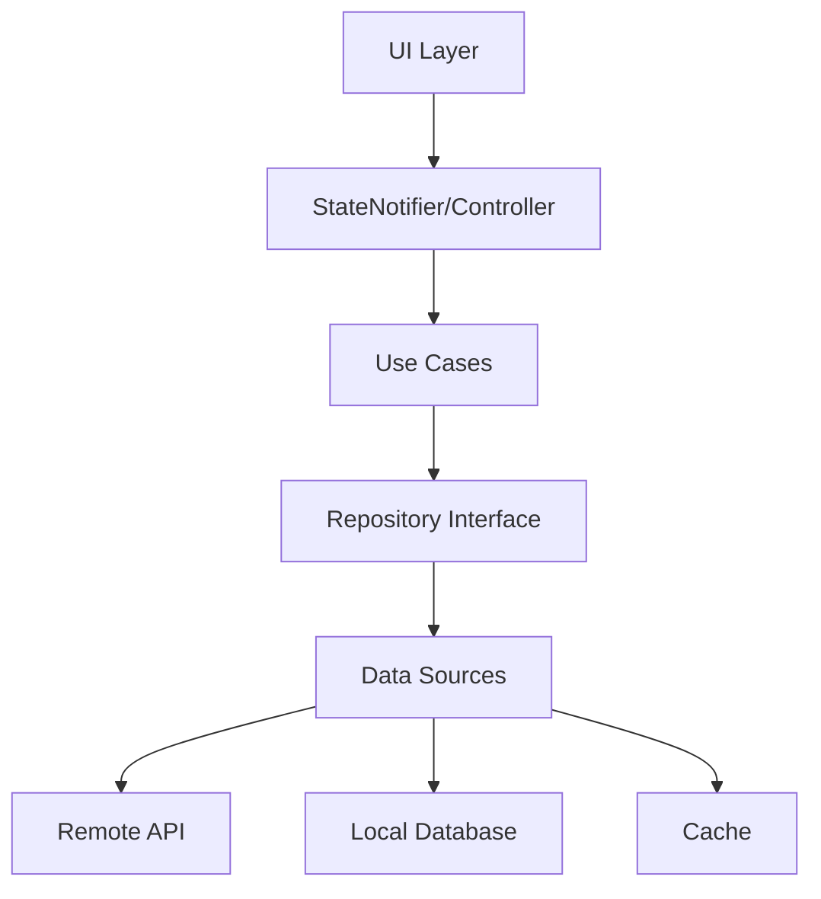

# 1. نظرة عامة على المعمارية النظيفة | Clean Architecture Overview
## Enterprise-Grade Flutter E-commerce Architecture | معمارية Flutter للتجارة الإلكترونية على مستوى المؤسسة

> **الجزء الأول: المعمارية والأنماط الأساسية | Part I: Architecture & Core Patterns**

**Target Application**: زهراء (Zahraah) - Women's Fashion E-commerce App  
**Platform**: Flutter (iOS + Android)  
**Architecture**: Clean Architecture + Feature-first structure  
**Language Support**: Arabic (RTL) + English (LTR)  
**Quality Level**: Enterprise-grade, Production-ready

---

## 🎯 **Objective | الهدف**
Implement Clean Architecture for robust, maintainable Flutter e-commerce application with clear separation of concerns and testable code structure.

## 📋 **Rule | القاعدة**
**Arabic**: افصل بين الطبقات: Presentation (UI), Application (State/Use-cases), Domain (Entities), Data (Repos & Sources)  
**English**: Separate layers: Presentation (UI), Application (State/Use-cases), Domain (Entities), Data (Repos & Sources)

## 💡 **Benefits | الفوائد**
- **Easy Testing | اختبار سهل**: Each layer can be tested independently without dependencies
- **Reduced Coupling | تقليل الترابط**: Changes in one layer don't affect others
- **Source Flexibility | مرونة المصادر**: Easy to switch data sources or UI frameworks
- **Maintainability | سهولة الصيانة**: Clear separation of concerns makes code easier to maintain
- **Team Collaboration | تعاون الفريق**: Different team members can work on different layers
- **Scalability | قابلية التوسع**: Easy to add new features without affecting existing code

## 🛠️ **Implementation | التطبيق**
- **Use in**: All features and modules across the application
- **How to implement**:
  - Create feature-first folder structure
  - Implement Repository pattern for data access
  - Use Dependency Injection for layer communication
  - Keep business logic in Domain layer only
  - Use interfaces/abstract classes for layer boundaries
- **Result**: Maintainable, testable, and scalable codebase

## ✅ **Success Criteria | معايير النجاح**

> **Reference**: See [Success Criteria Template](../../00-Templates/06-success-criteria-template.md) for standard criteria.

### **Architecture Specific Criteria:**
- [ ] All features follow clean architecture principles
- [ ] No direct API calls from UI layer
- [ ] Business logic isolated in Domain layer
- [ ] Easy to mock dependencies for testing
- [ ] Clear layer boundaries with no circular dependencies
- [ ] Each layer has single responsibility

## ⚠️ **Common Pitfalls | الأخطاء الشائعة**

> **Reference**: See [Common Pitfalls Template](../../00-Templates/05-common-pitfalls-template.md) for standard pitfalls.

### **Architecture Specific Pitfalls:**
- **Avoid**: Business logic in Widgets or UI components
- **Avoid**: Direct API calls from Presentation layer
- **Avoid**: Circular dependencies between layers
- **Avoid**: God classes that handle multiple responsibilities
- **Avoid**: Tight coupling between layers
- **Avoid**: Data layer knowing about UI requirements

## 🚨 **Risk Assessment | تقييم المخاطر**

> **Reference**: See [Risk Assessment Template](../00-Templates/01-risk-assessment-template.md) for standard risk categories.

### **Architecture-Specific Risks:**
| Risk | Impact | Probability | Mitigation Strategy |
|------|--------|-------------|-------------------|
| **Layer Violations** | High | Medium | Architecture tests, dependency rules, code reviews |
| **Circular Dependencies** | High | Medium | Dependency inversion, interface segregation |
| **God Classes** | Medium | High | Single responsibility principle, class decomposition |
| **Tight Coupling** | Medium | High | Dependency injection, abstraction layers |
| **Poor Testability** | High | Medium | Mock-friendly design, clear boundaries |
| **Performance Bottlenecks** | Medium | Low | Layer optimization, proper state management |

## 🎯 **Specific Priorities | الأولويات المحددة**

> **Framework**: See [Generic Priority Framework](../00-Templates/13-generic-priority-framework.md) for priority levels and criteria.

### **Architecture Overview Specific Priorities:**
#### **Phase 1: Foundation | المرحلة الأولى: الأساس**
- **🔴 Critical**: Clean Architecture layer separation and boundaries
- **🔴 Critical**: Repository pattern implementation and dependency injection
- **🟠 High**: Feature-first folder structure and basic state management

#### **Phase 2: Enhancement | المرحلة الثانية: التحسين**
- **🟠 High**: Interface segregation principles and error handling layer
- **🟠 High**: Testing infrastructure setup and architecture decision records
- **🟡 Medium**: Performance monitoring per layer and advanced patterns

#### **Phase 3: Optimization | المرحلة الثالثة: التحسين**
- **🟡 Medium**: Architecture documentation automation and layer-specific metrics
- **🟡 Medium**: Advanced architectural patterns and optimization
- **🟢 Low**: AI-assisted architecture decisions and advanced monitoring

---

## 📁 **هيكل المشروع المقترح | Recommended Project Structure**

```
/lib
  /features
    /catalog/          # UI + controllers + repo + models لهذه الميزة فقط
    /cart/
    /checkout/
  /core
    /domain/           # entities, value_objects
    /data/             # http_client, local_db, cache
    /app/              # router, theme, l10n, di, errors, result
```

---

## 🎯 **مثال هيكل ميزة | Feature Structure Example**

```
/features/catalog
  /presentation
    /pages/            # catalog_page.dart
    /widgets/          # product_tile.dart
    catalog_controller.dart (StateNotifier)
  /domain
    product.dart       # freezed entity
    catalog_repo.dart  # abstract interface
    usecases/
      get_product_list.dart
  /data
    catalog_repo_impl.dart
    catalog_remote_ds.dart
    catalog_local_ds.dart
```

---

## 🔄 **تدفق البيانات | Data Flow**



---

## 📋 **قواعد التصميم | Design Rules**

### **1. Dependency Rule**

- الطبقات الداخلية لا تعرف بالطبقات الخارجية
- التبعيات تشير للداخل فقط
- Use Cases لا تعرف بالـ UI أو Data

### **2. Interface Segregation**

- استخدم interfaces صغيرة ومتخصصة
- تجنب interfaces كبيرة ومتشعبة
- كل interface له مسؤولية واحدة

### **3. Single Responsibility**

- كل class له مسؤولية واحدة
- كل use case ينفذ عملية واحدة
- كل repository يدير مصدر بيانات واحد

---

## 🛠️ **أدوات التنفيذ | Implementation Tools**

### **State Management**

- **Riverpod** (مُوصى به) - Modern, testable, performant
- **Bloc** - Event-driven, predictable
- **Provider** - Simple, lightweight

### **Dependency Injection**

- **Riverpod Providers** - Built-in DI
- **GetIt** - Service locator
- **Injectable** - Code generation

### **Code Generation**

- **freezed** - Immutable classes
- **json_serializable** - JSON serialization
- **injectable** - Dependency injection

---

## 🚪 **Quality Gates | بوابات الجودة**

> **Reference**: See [Quality Gates Template](../00-Templates/03-quality-gates-template.md) for standard quality criteria.

### **Architecture-Specific Quality Gates:**
- [ ] Clean Architecture principles followed
- [ ] No circular dependencies between layers
- [ ] All layers properly separated and isolated
- [ ] Repository pattern implemented correctly
- [ ] Dependency injection working properly
- [ ] Feature-first folder structure maintained

## 📈 **Success Metrics | مؤشرات النجاح**

> **Reference**: See [Comprehensive Metrics Template](../00-Templates/15-comprehensive-metrics-template.md) for topic-specific metrics.

### **Architecture Overview Specific Metrics:**
- **Layer Separation**: 100% compliance with Clean Architecture principles
- **Dependency Direction**: All dependencies point inward, no circular dependencies
- **Testability**: Each layer can be tested independently with >90% coverage
- **Maintainability**: Changes in one layer don't affect others, <5% coupling
- **Scalability**: Easy to add new features without breaking existing code
- **Code Quality**: Maintainability index >80, cyclomatic complexity <10

## 🔧 **Troubleshooting | استكشاف الأخطاء وإصلاحها**

### **Common Architecture Issues:**

#### **1. Layer Violations**
**Problem**: Business logic in UI layer or direct API calls from widgets
**Solution**: 
- Move business logic to domain layer
- Use use cases for business operations
- Implement proper dependency injection

#### **2. Circular Dependencies**
**Problem**: Layer A depends on Layer B, and Layer B depends on Layer A
**Solution**:
- Use dependency inversion principle
- Create interfaces/abstract classes
- Implement proper abstraction layers

#### **3. God Classes**
**Problem**: Single class handling multiple responsibilities
**Solution**:
- Apply single responsibility principle
- Break down into smaller, focused classes
- Use composition over inheritance

#### **4. Tight Coupling**
**Problem**: Changes in one layer affect multiple other layers
**Solution**:
- Use dependency injection
- Implement interface segregation
- Create proper abstraction boundaries

## 📊 **مقاييس الجودة | Quality Metrics**

### **Architecture Compliance**

- [ ] طبقات منفصلة بوضوح
- [ ] تبعيات تشير للداخل
- [ ] Use cases معزولة
- [ ] Repositories مجردة

### **Testability**

- [ ] كل طبقة قابلة للاختبار
- [ ] Mocking سهل
- [ ] اختبارات سريعة
- [ ] تغطية عالية

### **Maintainability**

- [ ] كود قابل للقراءة
- [ ] مسؤوليات واضحة
- [ ] تغييرات محلية
- [ ] إعادة استخدام

---

## 🔗 **الروابط ذات الصلة | Related Links**

- [إدارة الحالة وحقن الاعتماديات](/2025-Plans/app_info/01-Architecture/02-state-management-di/)
- [طبقة البيانات ومعالجة الأخطاء](/2025-Plans/app_info/01-Architecture/03-data-layer-error-handling/)
- [طبقة المجال](/2025-Plans/app_info/01-Architecture/04-domain-layer/)
- [طبقة العرض](/2025-Plans/app_info/01-Architecture/05-presentation-layer/)

---

## 📚 **المراجع | References**

- [Clean Architecture by Robert C. Martin](https://blog.cleancoder.com/uncle-bob/2012/08/13/the-clean-architecture.html)
- [Flutter Architecture Samples](https://github.com/brianegan/flutter_architecture_samples)
- [Riverpod Documentation](https://riverpod.dev/)

---

## ✅ **Quality Standards & Success Criteria | معايير الجودة ومعايير النجاح**


### **Architecture-Specific Quality Requirements:**
- **Clean Architecture**: Proper layer separation and dependency direction
- **State Management**: Consistent and predictable state flow
- **Error Handling**: Result pattern implementation with user-friendly messages
- **Performance**: Optimized for mobile devices with <500ms response times
- **RTL Support**: Full Arabic layout support with proper text direction
- **Accessibility**: WCAG 2.1 AA compliance for inclusive design

---

**🔴 ENHANCEMENT**: محتوى مأخوذ من الوثائق الأصلية  
**🔵 SUGGESTION**: اقتراحات مبنية على الخبرة التقنية

**Last Updated | آخر تحديث**: January 2025  
**Version | الإصدار**: 2.0 - Enhanced Architecture  
**Status | الحالة**: ✅ Production Ready

---

## 🔗 **Navigation | التنقل**

<div class="navigation-links">

[Next: State Management & DI →](/2025-Plans/app_info/01-Architecture/02-state-management-di/)  
*التالي: إدارة الحالة وحقن التبعية*

[🏠 Home](/2025-Plans/)  
*الرئيسية*

</div>

## 🚪 **Quality Gates | بوابات الجودة**

> **Reference**: See [Quality Gates Template](../../00-Templates/03-quality-gates-template.md) for standard quality criteria.

### **Architecture-Specific Quality Gates:**
- [ ] Clean Architecture principles implemented correctly
- [ ] Proper separation of concerns between layers
- [ ] Dependency injection configured properly
- [ ] Error handling implemented with Result pattern
- [ ] State management follows best practices
- [ ] UI components follow design system standards
- [ ] RTL support implemented for Arabic markets
- [ ] Accessibility standards met (WCAG 2.1 AA)
- [ ] Performance benchmarks achieved
- [ ] Security best practices implemented

## 🧪 **Architecture Testing Strategy | استراتيجية اختبار المعمارية**

### **Testing Pyramid | هرم الاختبار**
```
    🔺 E2E Tests (10%)
   🔺🔺 Integration Tests (20%)
  🔺🔺🔺 Unit Tests (70%)
```

### **Testing Principles | مبادئ الاختبار**
- **Test Early**: Write tests during development, not after
- **Test Often**: Run tests frequently during development
- **Test Everything**: Cover all critical paths and edge cases
- **Test Realistic**: Use real data and scenarios when possible
- **Test Maintainable**: Keep tests simple and easy to update

## 🏗️ **Architecture Best Practices | أفضل ممارسات المعمارية**

### **Core Principles | المبادئ الأساسية**
1. **Separation of Concerns** - Each layer has a single responsibility
2. **Dependency Inversion** - Depend on abstractions, not concretions
3. **Single Responsibility** - Each class/module has one reason to change
4. **Open/Closed Principle** - Open for extension, closed for modification
5. **DRY (Don't Repeat Yourself)** - Avoid code duplication

## ✅ **Architecture Success Criteria | معايير نجاح المعمارية**

### **Definition of Success | تعريف النجاح**
Success is achieved when the architecture meets all technical, functional, and quality requirements while providing an excellent developer and user experience.

### **Success Metrics Categories | فئات مقاييس النجاح**
1. **Technical Excellence** - Code quality, performance, maintainability
2. **Functional Completeness** - All features working as expected
3. **Quality Assurance** - Testing, security, accessibility
4. **User Experience** - Performance, usability, satisfaction
5. **Developer Experience** - Documentation, tooling, productivity

## 🔧 **Architecture Troubleshooting | استكشاف أخطاء المعمارية**

### **Debugging Strategy | استراتيجية التصحيح**
1. **Identify the Problem** - Understand what's not working
2. **Reproduce the Issue** - Create consistent steps to reproduce
3. **Isolate the Cause** - Narrow down to specific component/layer
4. **Apply Solution** - Implement fix and verify
5. **Document Solution** - Update documentation for future reference

## ⚠️ **Common Pitfalls | الأخطاء الشائعة**

> **Reference**: See [Common Pitfalls Template](../../00-Templates/05-common-pitfalls-template.md) for standard pitfalls.

### **Architecture-Specific Pitfalls:**
- **Avoid**: Violating Clean Architecture principles
- **Avoid**: Tight coupling between layers
- **Avoid**: Missing dependency injection
- **Avoid**: Inconsistent error handling
- **Avoid**: Poor state management patterns
- **Avoid**: Ignoring RTL requirements
- **Avoid**: Missing accessibility features
- **Avoid**: Performance anti-patterns
- **Avoid**: Security vulnerabilities
- **Avoid**: Incomplete documentation

---
